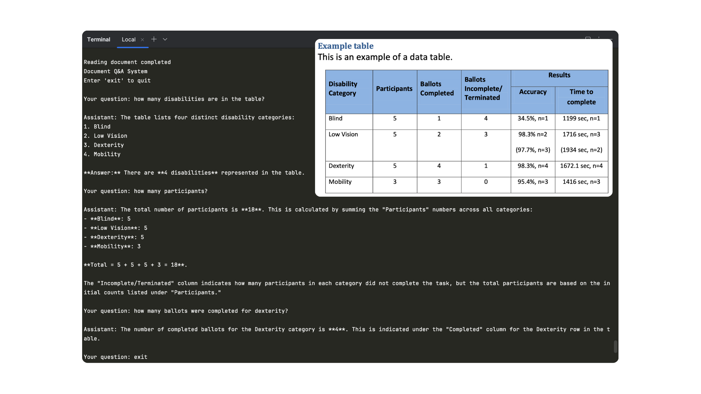

# PDF Question-Answering System

## Overview
This project is a Python-based document question-answering system that allows users to extract text from a PDF file and ask questions about its content using an AI model.

## Features
- Extract text from PDF documents using PDFPlumber
- Interactive command-line interface for asking questions
- AI-powered question answering based on document context
- Easy to use and extend

## Prerequisites
- Python 3.7+
- Internet connection for API calls

## Installation

### 1. Clone the Repository
```bash
git clone https://github.com/Apekshavh/PDF_QnA.git
cd PDF_QnA
```

### 2. Install Required Dependencies
```bash
pip install pdfplumber requests
```

## Configuration
1. Open `main.py`
2. Replace `YOUR_API_KEY_VALUE` with your actual API key
3. Replace `YOUR_API_URL_VALUE` with the correct API endpoint

## Project Structure
- `main.py`: Main application logic and user interaction
- `pdf_processing.py`: PDF text extraction functionality

## Usage
Run the application:
```bash
python main.py
```

### Interaction
- Enter questions about the PDF document
- Type 'exit' to quit the application

## Example
```
Document Q&A System
Enter 'exit' to quit

Your question: What is the main topic of this document?
Assistant: [AI-generated response based on PDF content]

Your question: exit
```

## Sample Output


## Dependencies
- pdfplumber: PDF text extraction
- requests: API communication

## Error Handling
- If the API call fails, an error message will be displayed
- If unsure about a question, the model will respond with "I don't know"

## Customization
- Modify `temperature` in `main.py` to adjust response creativity

## Limitations
- Requires a valid API key and endpoint
- Performance depends on the AI model and document complexity

## Contributing
Contributions are welcome! Please fork the repository and submit a pull request.
